# dot-sql

```yaml
apiVersion: devopstoolkit.live/v1beta1
kind: SQL
metadata:
  name: my-db
spec:
  version: "16.3"
  size: small
  region: us-east-1
  databases:
    - main
  schemas:
    - database: main
      sql: |
        create table videos (
          id varchar(50) not null,
          description text,
          primary key (id)
        );
        create table comments (
          id serial,
          video_id varchar(50) not null,
          description text not null,
          primary key (id),
          CONSTRAINT fk_videos FOREIGN KEY(video_id) REFERENCES videos(id)
        );
  secrets:
    storeName: aws
    pullRootPasswordKey: db-root-password
    pushToStore: true
  crossplane:
    compositionSelector:
      matchLabels:
        provider: aws
        db: postgresql
```

```mermaid
flowchart TD
    classDef compositeResource fill:#3498db,color:white
    classDef awsResource fill:#D35400,color:white
    classDef otherResource fill:#8E44AD,color:white

    SQL["SQL<br>devopstoolkit.live/v1beta1<br>my-db"]

    VPC["VPC<br>ec2.aws.m.upbound.io/v1beta1<br>my-db"]
    Gateway["InternetGateway<br>ec2.aws.m.upbound.io/v1beta1<br>my-db"]
    RouteTable["RouteTable<br>ec2.aws.m.upbound.io/v1beta1<br>my-db"]
    Route["Route<br>ec2.aws.m.upbound.io/v1beta2<br>my-db"]
    SecurityGroup["SecurityGroup<br>ec2.aws.m.upbound.io/v1beta1<br>my-db"]
    SecurityGroupRule["SecurityGroupRule<br>ec2.aws.m.upbound.io/v1beta1<br>my-db"]
    SubnetGroup["SubnetGroup<br>rds.aws.m.upbound.io/v1beta1<br>my-db"]
    RDSInstance["Instance<br>rds.aws.m.upbound.io/v1beta3<br>my-db"]

    Subnet1["Subnet<br>ec2.aws.m.upbound.io/v1beta1<br>my-db-a"]
    Subnet2["Subnet<br>ec2.aws.m.upbound.io/v1beta1<br>my-db-b"]
    Subnet3["Subnet<br>ec2.aws.m.upbound.io/v1beta1<br>my-db-c"]

    RTA1["RouteTableAssociation<br>ec2.aws.m.upbound.io/v1beta1<br>my-db-1a"]
    RTA2["RouteTableAssociation<br>ec2.aws.m.upbound.io/v1beta1<br>my-db-1b"]
    RTA3["RouteTableAssociation<br>ec2.aws.m.upbound.io/v1beta1<br>my-db-1c"]
    MainRTA["MainRouteTableAssociation<br>ec2.aws.m.upbound.io/v1beta1<br>my-db"]

    KubeSecret["Object<br>kubernetes.crossplane.io/v1alpha2<br>my-db-secret"]
    ExternalSecret["ExternalSecret<br>external-secrets.io/v1<br>my-db-password"]
    PushSecret["PushSecret<br>external-secrets.io/v1alpha1<br>my-db"]
    AtlasSchema["AtlasSchema<br>db.atlasgo.io/v1alpha1<br>my-db-main"]
    Database["Database<br>postgresql.sql.crossplane.io/v1alpha1<br>my-db-main"]
    ProviderConfig1["ProviderConfig<br>kubernetes.crossplane.io/v1alpha1<br>my-db-sql"]
    ProviderConfig2["ProviderConfig<br>postgresql.sql.crossplane.io/v1alpha1<br>my-db"]

    SQL --> VPC
    SQL --> Gateway
    SQL --> RouteTable
    SQL --> Route
    SQL --> SecurityGroup
    SQL --> SecurityGroupRule
    SQL --> SubnetGroup
    SQL --> RDSInstance
    SQL --> KubeSecret
    SQL --> ExternalSecret
    SQL --> PushSecret
    SQL --> AtlasSchema
    SQL --> Database
    SQL --> ProviderConfig1
    SQL --> ProviderConfig2
    SQL --> Subnet1
    SQL --> Subnet2
    SQL --> Subnet3
    SQL --> RTA1
    SQL --> RTA2
    SQL --> RTA3
    SQL --> MainRTA

    Gateway --> VPC
    RouteTable --> VPC
    Route --> RouteTable
    Route --> Gateway
    SecurityGroupRule --> SecurityGroup
    SecurityGroup --> VPC
    SubnetGroup --> Subnet1
    SubnetGroup --> Subnet2
    SubnetGroup --> Subnet3
    RDSInstance --> SubnetGroup
    RDSInstance --> SecurityGroup

    Subnet1 --> VPC
    Subnet2 --> VPC
    Subnet3 --> VPC
    
    RTA1 --> RouteTable
    RTA1 --> Subnet1
    RTA2 --> RouteTable
    RTA2 --> Subnet2
    RTA3 --> RouteTable
    RTA3 --> Subnet3
    MainRTA --> RouteTable
    MainRTA --> VPC

    Database --> ProviderConfig2
    AtlasSchema --> KubeSecret
    
    SQL:::compositeResource
    VPC:::awsResource
    Gateway:::awsResource
    RouteTable:::awsResource
    Route:::awsResource
    SecurityGroup:::awsResource
    SecurityGroupRule:::awsResource
    SubnetGroup:::awsResource
    RDSInstance:::awsResource
    Subnet1:::awsResource
    Subnet2:::awsResource
    Subnet3:::awsResource
    RTA1:::awsResource
    RTA2:::awsResource
    RTA3:::awsResource
    MainRTA:::awsResource
    KubeSecret:::otherResource
    ExternalSecret:::otherResource
    PushSecret:::otherResource
    AtlasSchema:::otherResource
    Database:::otherResource
    ProviderConfig1:::otherResource
    ProviderConfig2:::otherResource
```

