# dot-sql

```yaml
---
apiVersion: devopstoolkit.live/v1alpha1
kind: SQLClaim
metadata:
  name: my-db
spec:
  id: my-db
  compositionSelector:
    matchLabels:
      provider: aws
      db: postgresql
  parameters:
    version: "16.3"
    size: medium
    region: us-east-1
    databases:
      - db-01
      - db-02
```

```mermaid
flowchart TD
    classDef compositeResource fill:#3498db,color:white
    classDef awsResource fill:#D35400,color:white
    classDef otherResource fill:#8E44AD,color:white

    SQL["SQL<br>my-db"]:::compositeResource

    %% AWS Resources
    VPC["VPC<br>my-db"]:::awsResource
    Gateway["InternetGateway<br>my-db"]:::awsResource
    MainRTA["MainRouteTableAssociation<br>my-db"]:::awsResource
    RouteTable["RouteTable<br>my-db"]:::awsResource
    Route["Route<br>my-db"]:::awsResource
    RTA1["RouteTableAssociation<br>my-db-1a"]:::awsResource
    RTA2["RouteTableAssociation<br>my-db-1b"]:::awsResource
    RTA3["RouteTableAssociation<br>my-db-1c"]:::awsResource
    SecurityGroup["SecurityGroup<br>my-db"]:::awsResource
    SecurityGroupRule["SecurityGroupRule<br>my-db"]:::awsResource
    SubnetA["Subnet<br>my-db-a"]:::awsResource
    SubnetB["Subnet<br>my-db-b"]:::awsResource
    SubnetC["Subnet<br>my-db-c"]:::awsResource
    SubnetGroup["SubnetGroup<br>my-db"]:::awsResource
    RDSInstance["Instance<br>my-db"]:::awsResource

    %% Other Resources
    Database1["Database<br>my-db-db-01"]:::otherResource
    Database2["Database<br>my-db-db-02"]:::otherResource
    Secret["Secret<br>my-db-secret"]:::otherResource
    ProviderConfig1["ProviderConfig<br>my-db-sql-kubernetes"]:::otherResource
    ProviderConfig2["ProviderConfig<br>my-db-sql-helm"]:::otherResource
    SQLProviderConfig["ProviderConfig<br>my-db"]:::otherResource

    %% Resource Relationships
    SQL --> VPC
    SQL --> Gateway
    SQL --> MainRTA
    SQL --> RouteTable
    SQL --> Route
    SQL --> RTA1
    SQL --> RTA2
    SQL --> RTA3
    SQL --> SecurityGroup
    SQL --> SecurityGroupRule
    SQL --> SubnetA
    SQL --> SubnetB
    SQL --> SubnetC
    SQL --> SubnetGroup
    SQL --> RDSInstance
    SQL --> Database1
    SQL --> Database2
    SQL --> Secret
    SQL --> ProviderConfig1
    SQL --> ProviderConfig2
    SQL --> SQLProviderConfig

    Gateway --> VPC
    MainRTA --> RouteTable
    MainRTA --> VPC
    Route --> Gateway
    Route --> RouteTable
    RTA1 --> RouteTable
    RTA1 --> SubnetA
    RTA2 --> RouteTable
    RTA2 --> SubnetB
    RTA3 --> RouteTable
    RTA3 --> SubnetC
    SecurityGroupRule --> SecurityGroup
    SecurityGroup --> VPC
    SubnetA --> VPC
    SubnetB --> VPC
    SubnetC --> VPC
    SubnetGroup --> SubnetA
    SubnetGroup --> SubnetB
    SubnetGroup --> SubnetC
    RDSInstance --> SubnetGroup
    RDSInstance --> SecurityGroup
    Database1 --> SQLProviderConfig
    Database2 --> SQLProviderConfig
    Secret --> RDSInstance
```

