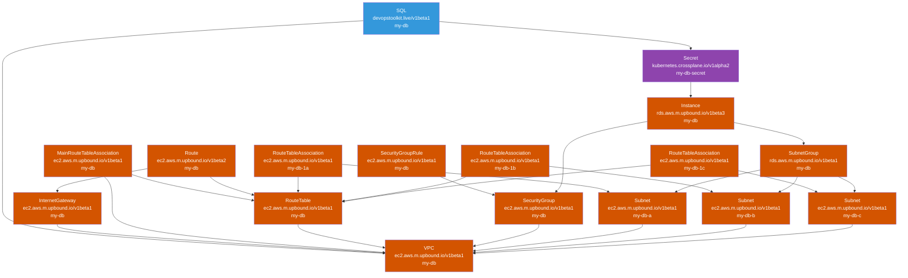

# dot-sql

```yaml
---
apiVersion: devopstoolkit.live/v1beta1
kind: SQL
metadata:
  name: my-db
spec:
  version: "16.3"
  size: medium
  region: us-east-1
  databases:
    - db-01
    - db-02
  crossplane:
    compositionSelector:
      matchLabels:
        provider: aws
        db: postgresql
```

