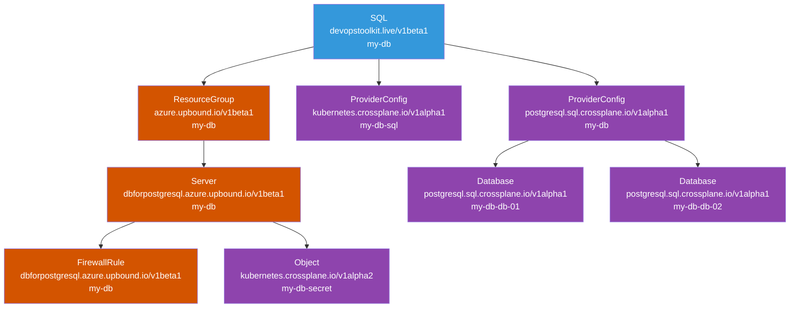

# dot-sql

```yaml
apiVersion: devopstoolkit.live/v1beta1
kind: SQL
metadata:
  name: my-db
spec:
  version: '11'
  size: small
  region: eastus
  databases:
    - db-01
    - db-02
  crossplane:
    compositionSelector:
      matchLabels:
        provider: azure
        db: postgresql
```

