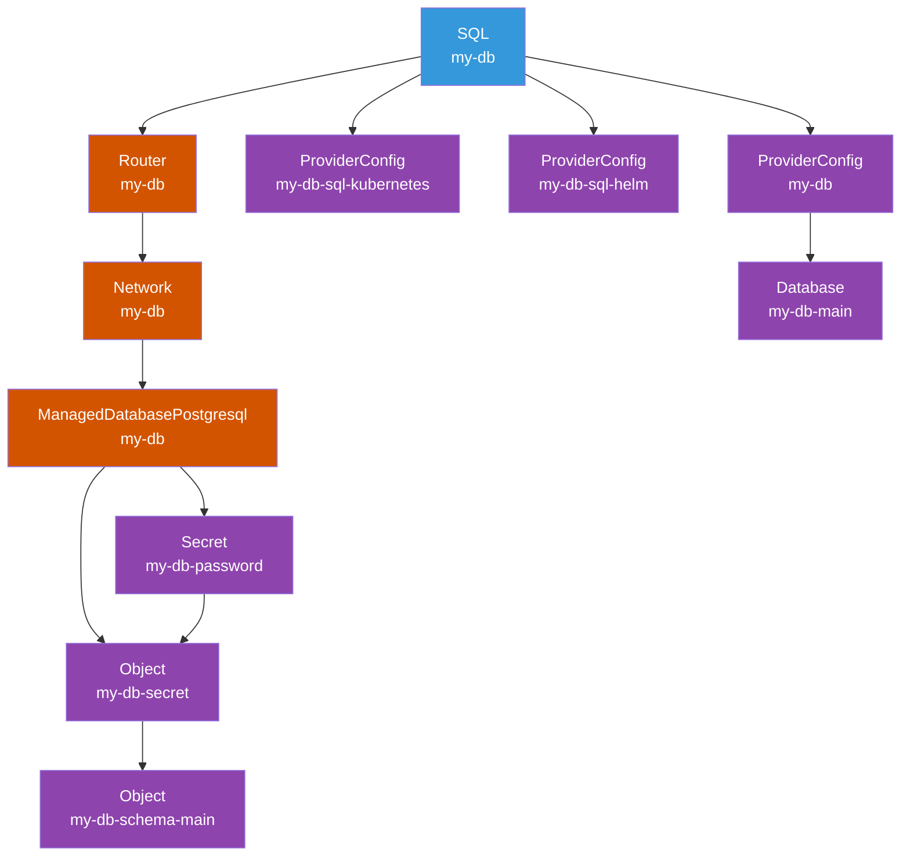

# dot-sql

```yaml
---
apiVersion: devopstoolkit.live/v1alpha1
kind: SQLClaim
metadata:
  name: my-db
spec:
  id: my-db
  compositionSelector:
    matchLabels:
      provider: upcloud
      db: postgresql
  parameters:
    size: small
    region: us-nyc1
    databases:
      - main
    schemas:
      - database: main
        sql: |
          create table videos (
            id varchar(50) not null,
            description text,
            primary key (id)
          );
          create table comments (
            id serial,
            video_id varchar(50) not null,
            description text not null,
            primary key (id),
            CONSTRAINT fk_videos FOREIGN KEY(video_id) REFERENCES videos(id)
          );
```

