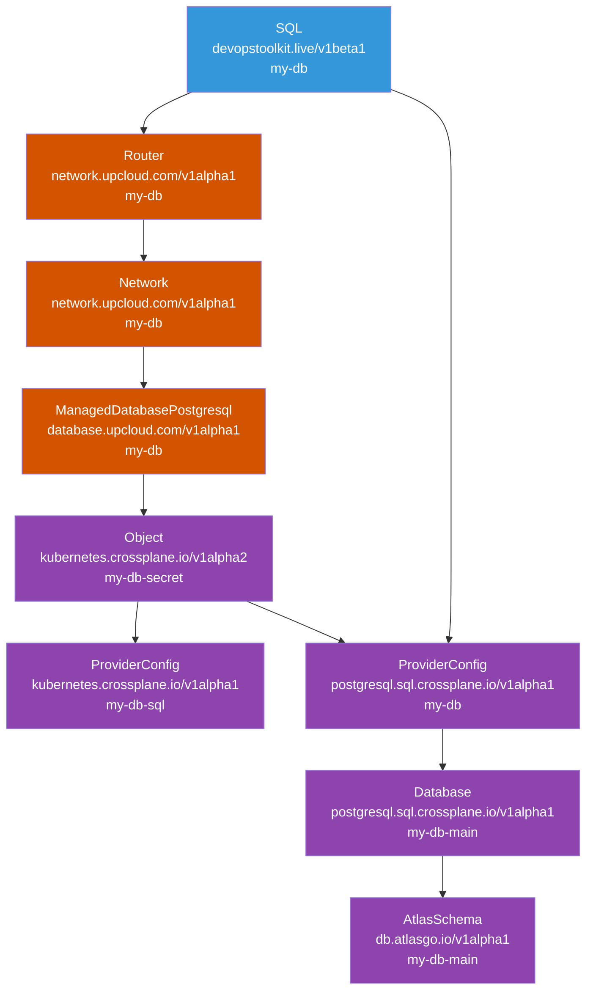

# dot-sql

```yaml
---
apiVersion: devopstoolkit.live/v1beta1
kind: SQL
metadata:
  name: my-db
spec:
  size: small
  region: us-nyc1
  databases:
    - main
  schemas:
    - database: main
      sql: |
        create table videos (
          id varchar(50) not null,
          description text,
          primary key (id)
        );
        create table comments (
          id serial,
          video_id varchar(50) not null,
          description text not null,
          primary key (id),
          CONSTRAINT fk_videos FOREIGN KEY(video_id) REFERENCES videos(id)
        );
  crossplane:
    compositionSelector:
      matchLabels:
        provider: upcloud
        db: postgresql
```

